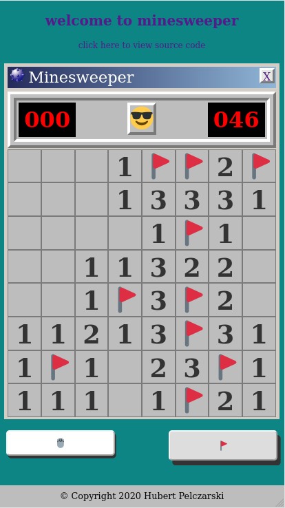
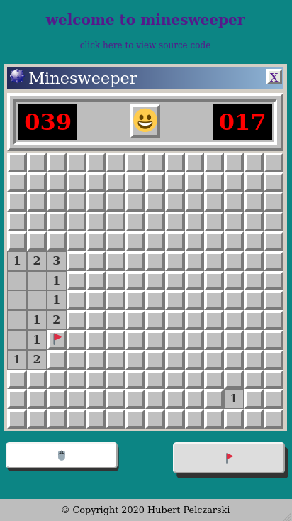
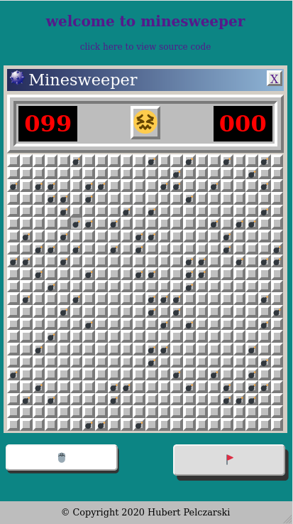

# minesweeper

start api server
```console
mvn clean && mvn spring-boot:run
```
install required dependencies for react frontend
```console
cd view && npm install
```

run frontend on localhost
```console
npm start
```

Easy             |  Medium         | Hard
:-------------------------:|:-------------------------:|:--------:
  |   | 

